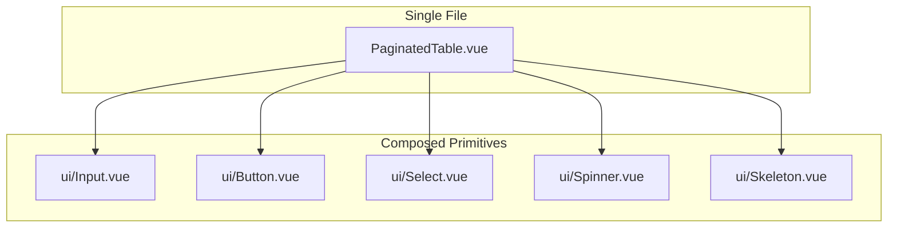
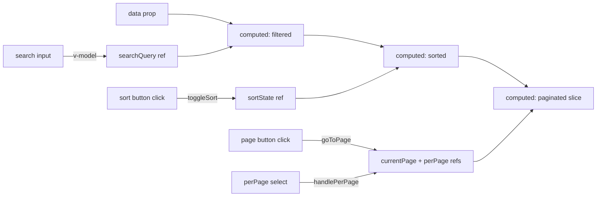

# Paginated Table Component — Plan (Revised)

## Overview

A single-file, reusable, client-side paginated table component following the existing design system patterns. It provides sorting, search, records-per-page, and optional jump-to-page controls.

## Architecture

Single component file that composes existing UI primitives:
- Reuses [`ui/Input.vue`](resources/js/components/ui/Input.vue) for search
- Reuses [`ui/Button.vue`](resources/js/components/ui/Button.vue) for controls
- Reuses [`ui/Select.vue`](resources/js/components/ui/Select.vue) for per-page
- Reuses [`ui/Spinner.vue`](resources/js/components/ui/Spinner.vue) for loading
- Reuses [`ui/Skeleton.vue`](resources/js/components/ui/Skeleton.vue) for row skeletons



## File Structure

```
resources/js/
  components/
    PaginatedTable.vue          (new — single file, all logic + template)
  lib/
    uiClass.ts                  (modify — add table class helpers)
  types/
    index.d.ts                  (modify — add table interfaces)
  components/playgrounds/tables/
    Playground.vue              (new — demo page)
    options.ts                  (new — mock data + column defs)
```

## TypeScript Types (types/index.d.ts)

```ts
export interface TableColumn<T = Record<string, unknown>> {
    key: string;
    label: string;
    sortable?: boolean;
    searchable?: boolean;
    width?: string;          // Tailwind width class e.g. 'w-32'
    className?: string;      // cell class
    headerClassName?: string;
    format?: (value: unknown, row: T) => string;
}

export interface SortState {
    key: string | null;
    direction: 'asc' | 'desc';
}
```

## Props API — PaginatedTable.vue

| Prop | Type | Default | Description |
|------|------|---------|-------------|
| `columns` | `TableColumn[]` | (required) | Column definitions |
| `data` | `unknown[]` | (required) | Row data |
| `loading` | `boolean` | `false` | Show loading skeleton |
| `searchable` | `boolean` | `true` | Show search bar |
| `showPerPage` | `boolean` | `true` | Show records-per-page selector |
| `perPageOptions` | `number[]` | `[10, 25, 50, 100]` | Options for per-page |
| `defaultPerPage` | `number` | `10` | Default records per page |
| `showJumpToPage` | `boolean` | `false` | Show jump-to-page input |
| `borders` | `'horizontal' \| 'full'` | `'horizontal'` | Table border style |
| `striped` | `boolean` | `false` | Alternating row colors |
| `hoverable` | `boolean` | `true` | Row hover highlight |
| `emptyMessage` | `string` | `'No records found.'` | Empty state text |
| `sortable` | `boolean` | `true` | Enable column sorting |
| `defaultSort` | `{key: string, direction: 'asc'|'desc'}` | — | Initial sort |

### Events

| Event | Payload | Description |
|-------|---------|-------------|
| `update:search` | `string` | Search query changed |
| `update:sort` | `{key: string|null, direction: 'asc'|'desc'}` | Sort changed |
| `update:page` | `number` | Page changed |
| `update:perPage` | `number` | Per-page changed |

### Slots

| Slot | Props | Description |
|------|-------|-------------|
| `header` | — | Custom table header (above column headers) |
| `footer` | `{ currentPage, perPage, total, totalPages }` | Custom footer |
| `cell-{key}` | `{ value, row }` | Custom cell renderer |
| `empty` | — | Custom empty state |

## Border Modes

Two border modes:

| Mode | CSS | Visual |
|------|-----|--------|
| `horizontal` (default) | `border-collapse`, `border-b` on header row + each row, no vertical borders | Clean horizontal lines only |
| `full` | `border-collapse`, `border` on all cells | Classic grid table |

For `horizontal` mode (default): the table looks clean inside cards. Row separation is via `border-b` on `<tr>`. No vertical dividers.

## Internal State (ref/computed)

```ts
const searchQuery = ref('');
const sortState = ref<SortState>({ key: null, direction: 'asc' });
const currentPage = ref(1);
const perPage = ref(props.defaultPerPage);

// Computed pipeline
const filteredData = computed(() => {
    // filter data by searchQuery across searchable columns
});
const sortedData = computed(() => {
    // sort filteredData by sortState
});
const paginatedData = computed(() => {
    // slice sortedData for current page
});
const totalPages = computed(() => Math.ceil(filteredData.value.length / perPage.value));
```

## Template Structure (single file)

```vue
<template>
    <div class="space-y-4">
        <!-- Search Bar -->
        <div v-if="searchable" class="flex items-center gap-2">
            <div class="relative flex-1">
                <IconLucideSearch class="absolute left-3 top-1/2 -translate-y-1/2 h-4 w-4 text-foreground-faint" />
                <UIInput
                    v-model="searchQuery"
                    placeholder="Search..."
                    class="pl-9"
                />
                <button
                    v-if="searchQuery"
                    type="button"
                    class="absolute right-3 top-1/2 -translate-y-1/2"
                    @click="searchQuery = ''"
                >
                    <IconLucideX class="h-4 w-4 text-foreground-faint hover:text-foreground" />
                </button>
            </div>
        </div>

        <!-- Table -->
        <div class="relative">
            <!-- Loading overlay -->
            <div v-if="loading" class="absolute inset-0 flex items-center justify-center bg-background/80">
                <Spinner size="lg" />
            </div>

            <div class="overflow-auto rounded-md border border-border">
                <table :class="tableContainerClass">
                    <thead>
                        <tr :class="headerRowClass">
                            <th v-for="col in columns" :key="col.key" :class="headerCellClass">
                                <button
                                    v-if="col.sortable && sortable"
                                    type="button"
                                    class="inline-flex items-center gap-1 hover:opacity-80"
                                    @click="toggleSort(col.key)"
                                >
                                    {{ col.label }}
                                    <IconLucideChevronUp v-if="sortState.key === col.key && sortState.direction === 'asc'" class="h-3 w-3" />
                                    <IconLucideChevronDown v-else class="h-3 w-3 opacity-40" />
                                </button>
                                <span v-else>{{ col.label }}</span>
                            </th>
                        </tr>
                    </thead>
                    <tbody>
                        <!-- Skeleton rows when loading -->
                        <tr v-if="loading" v-for="n in skeletonRows" :key="n" class="skeleton-row">
                            <td v-for="col in columns" :key="col.key">
                                <Skeleton class="h-4 w-full" />
                            </td>
                        </tr>

                        <!-- Data rows -->
                        <tr v-else v-for="(row, idx) in paginatedData" :key="idx" :class="rowClass(idx)">
                            <td v-for="col in columns" :key="col.key" :class="cellClass">
                                <slot :name="`cell-${col.key}`" :value="row[col.key]" :row="row">
                                    {{ col.format ? col.format(row[col.key], row) : row[col.key] }}
                                </slot>
                            </td>
                        </tr>

                        <!-- Empty state -->
                        <tr v-if="!loading && paginatedData.length === 0">
                            <td :colspan="columns.length" class="text-center py-8 text-foreground-subtle">
                                <slot name="empty">{{ emptyMessage }}</slot>
                            </td>
                        </tr>
                    </tbody>
                </table>
            </div>
        </div>

        <!-- Pagination Bar -->
        <div v-if="!loading && filteredData.length > 0" class="flex items-center justify-between">
            <div class="flex items-center gap-2 text-sm text-foreground-subtle">
                <span>Showing {{ startRecord }}-{{ endRecord }} of {{ filteredData.length }} records</span>

                <!-- Per-page selector -->
                <div v-if="showPerPage" class="flex items-center gap-2">
                    <span>Per page:</span>
                    <div class="relative">
                        <select
                            :value="perPage"
                            @change="handlePerPageChange(Number($event.target.value))"
                            class="h-8 rounded-md border border-border bg-background px-2 text-sm text-foreground outline-none focus:ring-2 focus:ring-focus-ring"
                        >
                            <option v-for="opt in perPageOptions" :key="opt" :value="opt">{{ opt }}</option>
                        </select>
                    </div>
                </div>
            </div>

            <div class="flex items-center gap-1">
                <Button variant="outline" size="sm" :disabled="currentPage <= 1" @click="goToPage(currentPage - 1)">
                    <IconLucideChevronUp class="rotate-90 h-4 w-4" />
                </Button>

                <template v-for="page in visiblePages" :key="page">
                    <Button
                        v-if="page !== '...'"
                        variant="ghost"
                        size="sm"
                        :class="{ 'bg-secondary': page === currentPage }"
                        @click="goToPage(Number(page))"
                    >
                        {{ page }}
                    </Button>
                    <span v-else class="px-2 text-foreground-faint">…</span>
                </template>

                <Button variant="outline" size="sm" :disabled="currentPage >= totalPages" @click="goToPage(currentPage + 1)">
                    <IconLucideChevronDown class="rotate-90 h-4 w-4" />
                </Button>

                <!-- Jump to page -->
                <div v-if="showJumpToPage" class="ml-2 flex items-center gap-1">
                    <span class="text-sm text-foreground-subtle">Go to:</span>
                    <input
                        type="number"
                        min="1"
                        :max="totalPages"
                        class="h-8 w-16 rounded-md border border-border bg-background px-2 text-sm text-foreground text-center outline-none focus:ring-2 focus:ring-focus-ring"
                        @keyup.enter="jumpToPage(Number($event.target.value))"
                    />
                </div>
            </div>
        </div>
    </div>
</template>
```

## Class Helpers (uiClass.ts additions)

```ts
export const tableContainerBase = 'overflow-auto';

export const tableBaseClasses = (borders: 'horizontal' | 'full') =>
    cn(
        'w-full text-sm text-foreground',
        borders === 'full' ? 'border-collapse' : 'border-collapse',
    );

export const headerRowClasses = (borders: 'horizontal' | 'full') =>
    cn(
        'bg-secondary',
        borders === 'full' ? 'border border-border' : 'border-b border-border',
    );

export const headerCellClasses = (borders: 'horizontal' | 'full') =>
    cn(
        'h-12 px-4 text-left align-middle font-medium text-foreground',
        borders === 'full' && 'border border-border',
    );

export const cellClasses = (borders: 'horizontal' | 'full') =>
    cn(
        'px-4 py-3 align-middle',
        borders === 'full' ? 'border border-border' : 'border-b border-border',
    );

export const rowClasses = (borders: 'horizontal' | 'full', striped: boolean, hoverable: boolean, index: number) =>
    cn(
        borders === 'full' ? 'border border-border' : 'border-b border-border',
        striped && index % 2 === 0 && 'bg-secondary/30',
        hoverable && 'transition-colors hover:bg-secondary-soft',
    );
```

## Data Flow



## Implementation Order

1. **Types** — Add interfaces to `types/index.d.ts`
2. **uiClass helpers** — Add table class functions to `uiClass.ts`
3. **PaginatedTable.vue** — Single file, all logic + template + composed primitives
4. **Playground** — Demo page with mock data

## Design Token Usage

| Token | Usage |
|-------|-------|
| `--background` | Table background, input bg |
| `--foreground` | Cell text, label text |
| `--secondary` | Header background |
| `--secondary-soft` | Row hover |
| `--border` | Cell/row borders |
| `--focus-ring` | Focus states on inputs/selects |
| `--radius-md` | Rounded inputs, buttons |

Dark mode is supported automatically via CSS variable inheritance.
